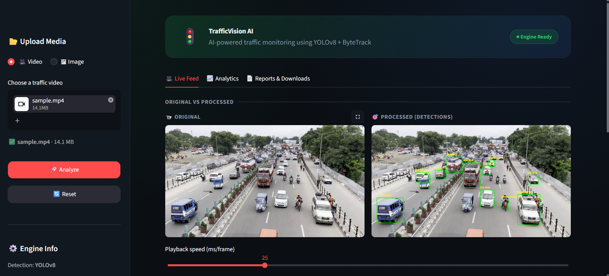
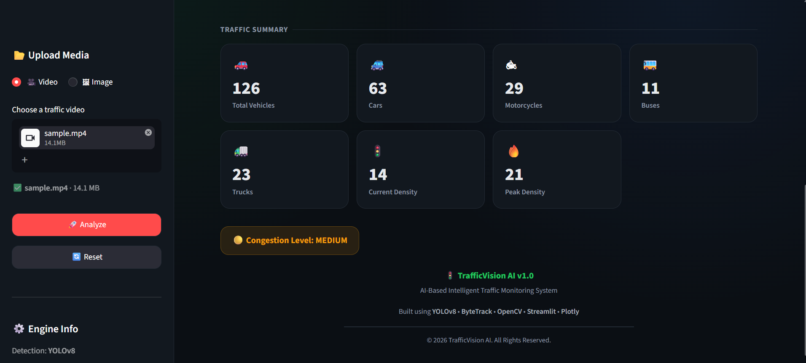
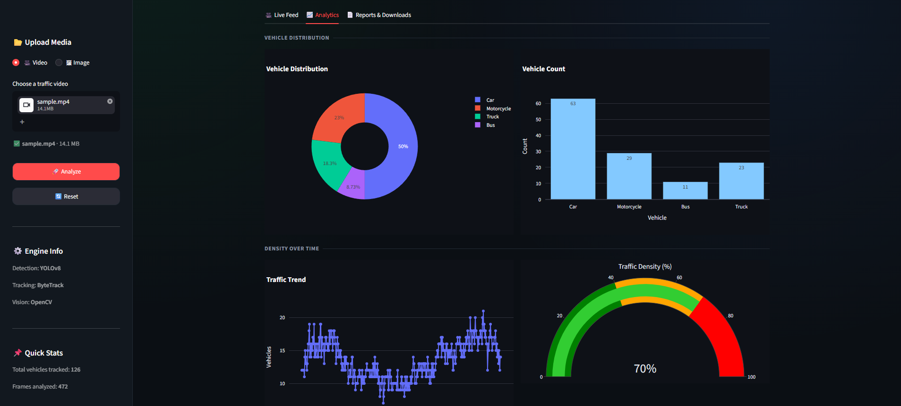
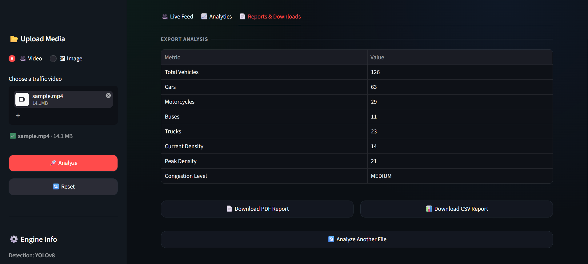

# 🚦 TrafficVision AI

> **AI-Based Intelligent Traffic Monitoring & Analytics System**

TrafficVision AI is an AI-powered traffic analysis application that detects, tracks, and counts vehicles from uploaded traffic images and videos. The system performs intelligent traffic analysis by calculating vehicle counts, traffic density, congestion levels, and visual analytics while generating downloadable PDF and CSV reports.

---

## 🎥 Project Overview

TrafficVision AI leverages modern Computer Vision techniques to automate traffic monitoring and analytics. It eliminates the need for manual traffic observation by providing accurate vehicle detection, tracking, density estimation, and interactive visualizations that support smarter traffic management and planning.

---

## ✨ Features

- 🚗 Vehicle Detection using **YOLOv8**
- 🎯 Multi-Object Tracking
- 📊 Automatic Vehicle Counting
- 🚦 Traffic Density Analysis
- 📈 Interactive Dashboard with Plotly
- 🖼️ Traffic Image Analysis
- 🎥 Traffic Video Analysis
- 📄 PDF Report Generation
- 📥 CSV Report Export
- 🔄 Reset & Re-analyze Files
- 🌙 Modern Streamlit User Interface

---

## ⚙️ How It Works

1. Upload a traffic image or video.
2. The system detects vehicles using **YOLOv8**.
3. Vehicles are tracked throughout the video.
4. Vehicle counts are calculated automatically.
5. Traffic density and congestion levels are analyzed.
6. Interactive charts and dashboards are generated.
7. Download professional PDF and CSV reports.

---

## 📸 Application Screenshots

### 🚗 Live Vehicle Detection



---

### 📊 Traffic Summary



---

### 📈 Analytics Dashboard



---

### 📄 Reports & Downloads



---

## 🛠️ Tech Stack

| Technology | Purpose |
|------------|---------|
| Python | Programming Language |
| YOLOv8 | Vehicle Detection |
| OpenCV | Image & Video Processing |
| Streamlit | Web Application |
| Plotly | Interactive Dashboard |
| Pandas | Data Processing |
| ReportLab | PDF Report Generation |

---

## 📂 Project Structure

```text
TrafficVision-AI/
│
├── app.py
├── requirements.txt
├── README.md
│
├── css/
│   └── style.css
│
├── models/
│   └── yolov8n.pt
│
├── screenshots/
│   ├── live-feed.png
│   ├── traffic-summary.png
│   ├── analytics-dashboard.png
│   └── reports-download.png
│
├── src/
│   ├── detector.py
│   ├── tracker.py
│   ├── counter.py
│   ├── density.py
│   ├── dashboard.py
│   ├── report_generator.py
│   └── video_processor.py
│
├── data/
│   ├── inputs/
│   ├── outputs/
│   └── reports/
│
└── test_tracker.py
```

---

## 🚀 Installation

### Clone the Repository

```bash
git clone https://github.com/SyedJunaidImran/TrafficVision-AI.git
```

```bash
cd TrafficVision-AI
```

### Create a Virtual Environment

```bash
python -m venv venv
```

### Activate the Virtual Environment

**Windows**

```bash
venv\Scripts\activate
```

**Linux / macOS**

```bash
source venv/bin/activate
```

### Install Dependencies

```bash
pip install -r requirements.txt
```

### Run the Application

```bash
streamlit run app.py
```

---

## 📊 Output

After processing an image or video, the application provides:

- 🚗 Total Vehicle Count
- 🚙 Vehicle-wise Classification
- 🚦 Current Traffic Density
- 🔥 Peak Traffic Density
- 🚧 Congestion Level
- 📈 Interactive Charts
- 📄 Downloadable PDF Report
- 📊 Downloadable CSV Report

---

## 🌍 Applications

TrafficVision AI can be applied in:

- 🚦 Smart Traffic Monitoring
- 🏙️ Urban Traffic Management
- 📊 Traffic Analytics & Reporting
- 🚓 CCTV Traffic Surveillance
- 🛣️ Highway Traffic Monitoring
- 🚧 Congestion Analysis
- 🏗️ Infrastructure Planning
- 🏙️ Smart City Projects
- 🎉 Event Traffic Management
- 📚 Transportation Research

---

## 🔮 Future Enhancements

- 🚑 Emergency Vehicle Detection
- 🚦 Intelligent Traffic Signal Recommendation
- 🚗 Vehicle Speed Estimation
- 🔢 Automatic Number Plate Recognition (ANPR)
- 🚨 Accident Detection
- ↩️ Wrong-Way Vehicle Detection
- 📡 Live CCTV Camera Integration
- ☁️ Cloud Deployment
- 📱 Mobile Application Support

---

## 🙏 Acknowledgements

This project was built using several outstanding open-source technologies:

- **YOLOv8** by Ultralytics
- **OpenCV**
- **Streamlit**
- **Plotly**
- **Pandas**
- **ReportLab**

Special thanks to the open-source community for making these technologies available.

---

## 👨‍💻 Author

**Syed Junaid Imran**

B.Tech Computer Science & Engineering

Presidency University, Bengaluru

GitHub: https://github.com/SyedJunaidImran

---

## 📄 License

This project has been developed for educational and academic purposes.

---

## ⭐ Support

If you found this project helpful or interesting, please consider giving it a ⭐ on GitHub.

It helps others discover the project and motivates further improvements.

---

## 🚀 TrafficVision AI

**Detect • Track • Count • Analyze • Report**